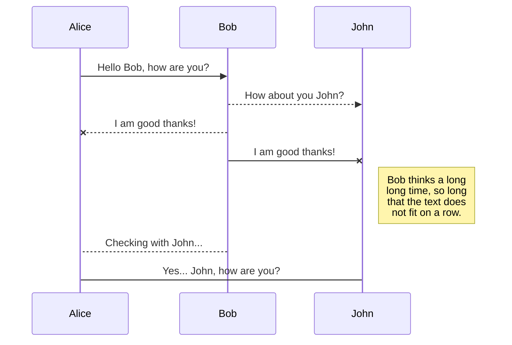

# synapse
*Description:* Project 3 repo, temporarily named synapse
University of Arizona Coding Bootcamp

### Group Project Members
#### Keith Downey / Derek Maloney / Alex Lialios / Miguel Peralta


## About this Project

The front end allows us to view the current information inside our database. It also allows us to add new data into it, delete a present data and update an already existing one. (CRUD)
We will use **create-react-app** to bootstrap our front end, which means that we will not have to worry about setting up Webpack or Babel (as create-react-app sorts this all out by default).

---
## Stuff we are trying, experimenting with, etc
- ### **react-table** // Fully customizable (JSX, templates, state, styles, callbacks)
	> https://react-table.js.org/#/story/simple-table

- ### **Browsersync** // Time-saving synchronised browser testing.
	> https://www.browsersync.io/

- ### **react-table** // Fully customizable (JSX, templates, state, styles, callbacks)
	> https://react-table.js.org/#/story/simple-table




`
```
# Yarn
$ yarn add react-table
```


## Starting the app locally

Start by installing front and backend dependencies. While in this directory, run the following command:

```
yarn install
```

This should install node modules within the server and the client folder.

After both installations complete, run the following command in your terminal:

```
yarn start
```

Your app should now be running on <http://localhost:3000>. The Express server should intercept any AJAX requests from the client.

## Deployment (Heroku)

To deploy, simply add and commit your changes, and push to Heroku. As is, the NPM scripts should take care of the rest.


---
```javascript
const project3 = "synapse";
alert(project3);
```

